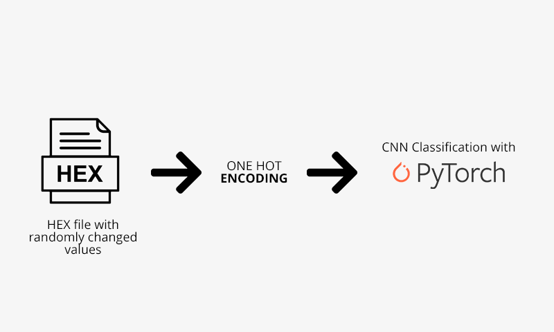

# Pytorch Hex Classifier with Flask Simple Web Interface

This repo contains the training code and web interface for PyTorch written Convolutional Neural Network for filetype classification, knowing only its' HEX value, moreover HEX value can be damaged (i.e changed in some bytes).

The pipeline of the model is the following:

The webinterface is implemented using Flask and looks like that:

The current pretrained model, supports the following set of files:
`bmp, flv, jpg, mp3, mp4, pdf, png, wav`

## To run the app, perform the following set of steps:
1. Clone the repo and run `pip -r install requirements.txt`
2. Run the app with `python main.py`, then choose the file, which file type you would like to predict.
3. Note, that to retrain the model you should change MAPPING param values both in the training script and in the `main.py` file
